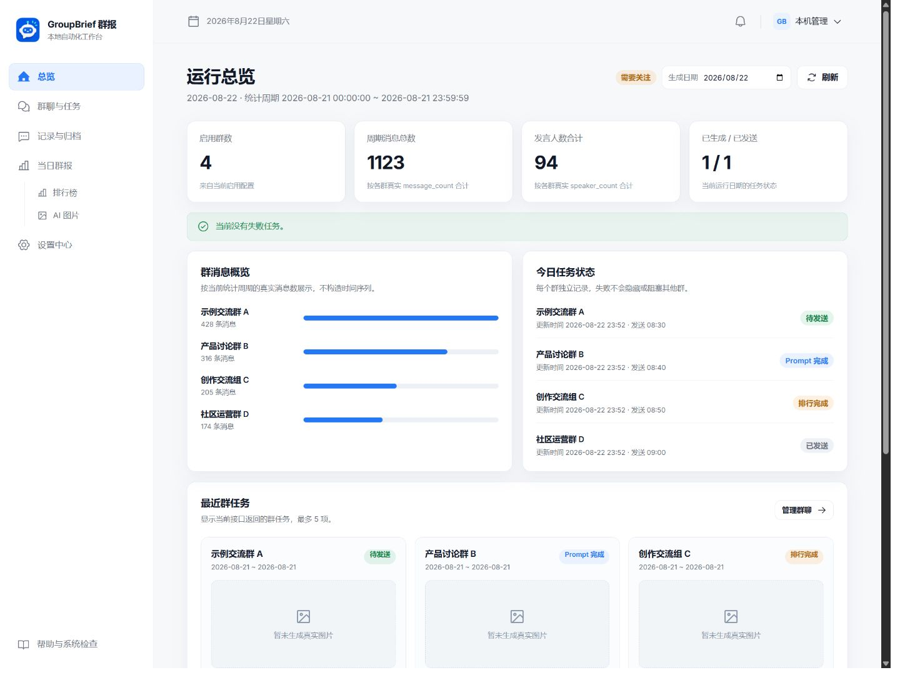
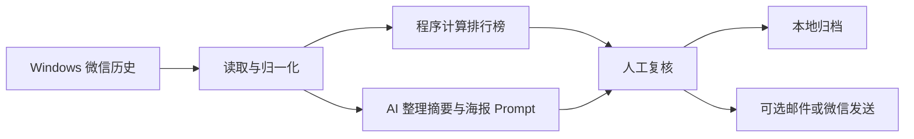
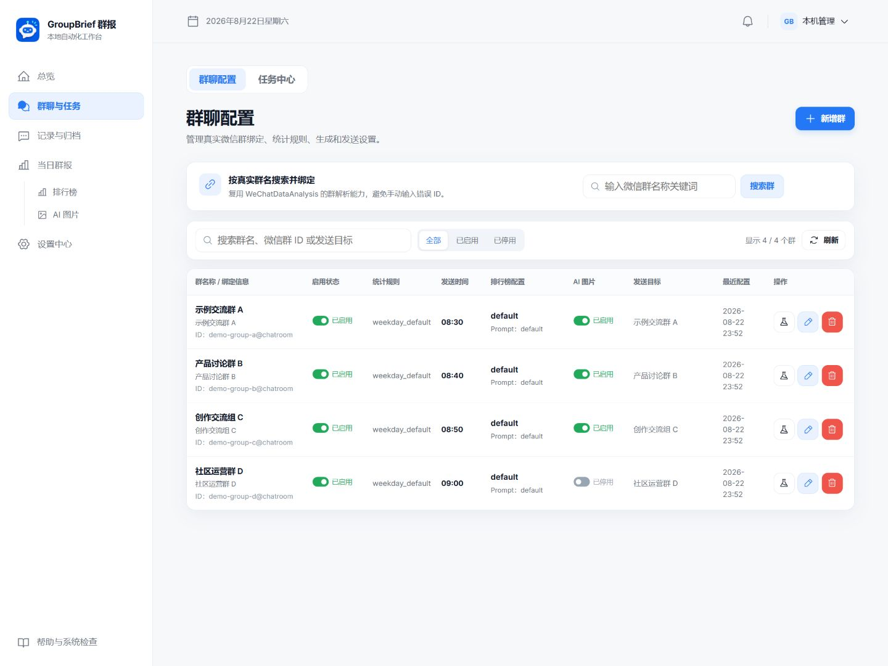
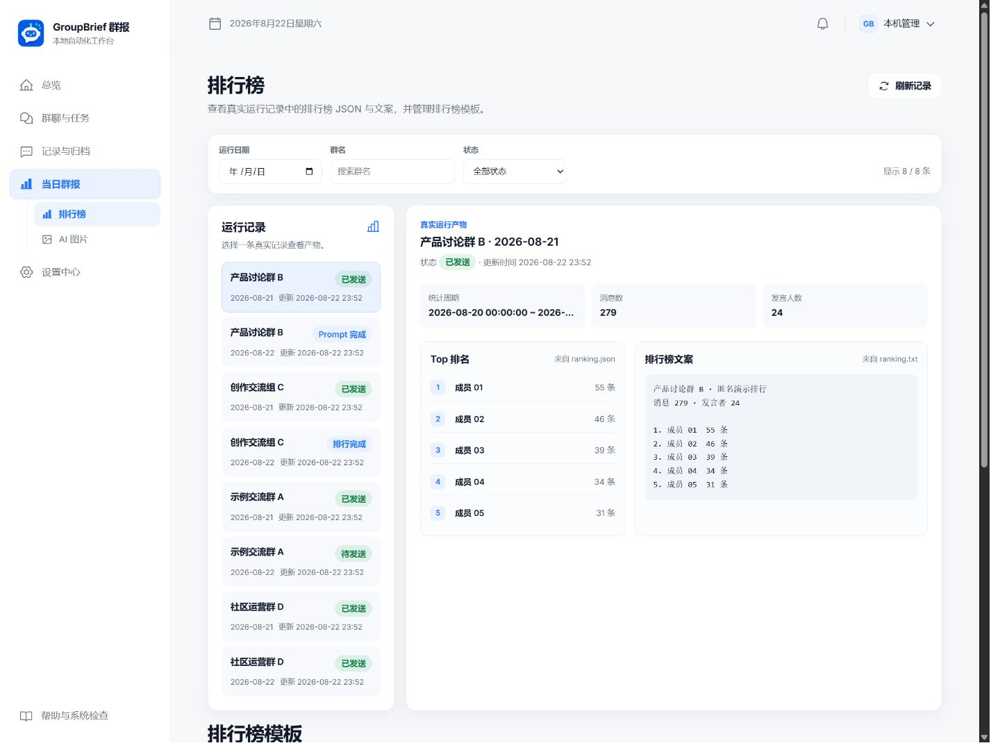
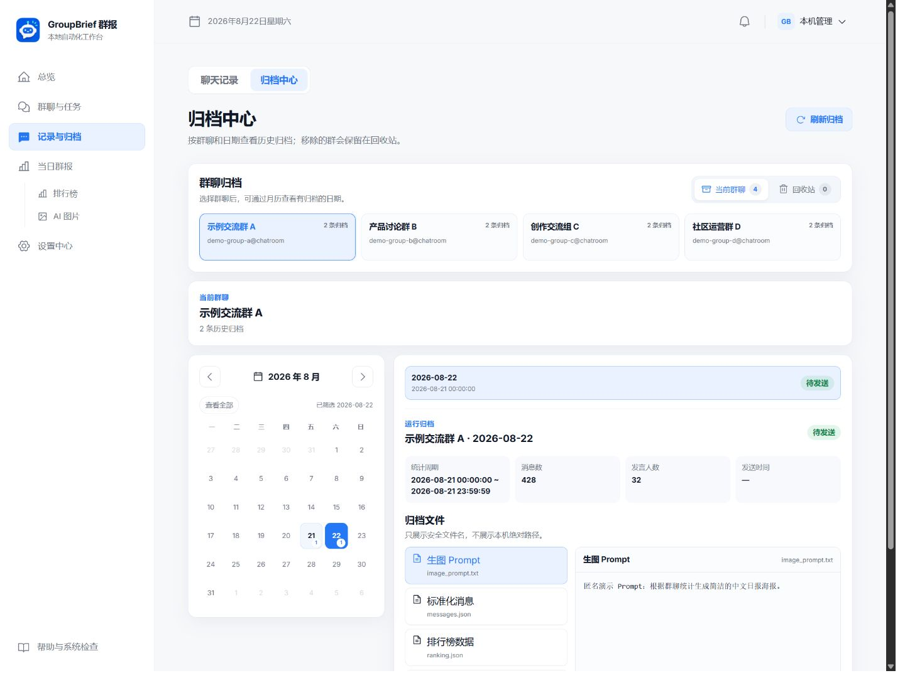

<p align="center">
  
</p>

<h1 align="center">GroupBrief 群报</h1>

<p align="center">面向 Windows 的本地微信群日报工作台：读取群聊记录，生成排行榜、AI 摘要与海报，并支持复核、归档和可选发送。</p>

<p align="center">
  <a href="https://github.com/damingishere-coder/GroupBrief/actions/workflows/ci.yml"></a>
  <a href="https://github.com/damingishere-coder/GroupBrief/releases"></a>
  <a href="LICENSE"></a>
</p>

<p align="center">
  <a href="#快速开始">快速开始</a> ·
  <a href="#工作方式">工作方式</a> ·
  <a href="#产品界面">产品界面</a> ·
  <a href="#当前状态与限制">当前限制</a>
</p>



## 为什么需要 GroupBrief

活跃群聊每天会产生大量消息，重要讨论、资源和待办很容易被后续消息淹没。GroupBrief 把“翻记录、数消息、整理重点、生成海报、归档结果”变成一条可复核的本地工作流。

- 排行榜由程序确定性计算，LLM 不参与数字统计。
- 每个群、每个日期独立运行和保存，失败不会隐藏其他群的结果。
- 对外发送默认关闭；先查看真实消息、排行榜、Prompt 和图片，再决定是否发送。

## Available Now

| 能力 | 当前行为 |
| --- | --- |
| 群聊接入 | 通过 WeChatDataAnalysis MCP 或结构化 JSON 读取历史；支持搜索、绑定和测试读取 |
| 精确排行榜 | 统计消息数、发言人数和 Top10，并生成结构化 JSON 与固定格式文本 |
| AI 日报与海报 | Codex GPT 生成摘要和海报 Prompt；可配置 DeepSeek 作为失败备用 |
| 图片工作流 | 按群配置图片主题和 Prompt，支持串行生图、Prompt 编辑、重新生成与人工复核 |
| 本地管理界面 | 提供总览、群聊与任务、排行榜、AI 图片、聊天归档和设置页面 |
| 调度与归档 | 每日生成前一日群报，按 `output/<群>/<日期>/` 保存完整运行文件 |
| 可选交付 | 支持邮件；微信文字/图片发送适配器默认关闭，并带防重复和异常状态保护 |

## 工作方式



聊天数据库和运行文件保留在本机。使用 Codex 或 DeepSeek 时，完成总结与生图所需的内容会发送到你选择的模型服务；GroupBrief 不会默认把整个微信数据库作为一次请求上传。

## 产品界面

以下均为当前真实应用界面，截图运行在隔离的匿名演示数据上；没有复制真实聊天数据库，也没有使用生成式假 UI。

| 群聊与任务 | 排行榜 |
| --- | --- |
|  |  |

| 归档中心 | 运行总览 |
| --- | --- |
|  |  |

## 快速开始

### 环境要求

| 项目 | 要求 |
| --- | --- |
| 操作系统 | Windows 10/11 |
| Python | 3.10 或更高版本 |
| Node.js | 18 或更高版本；首次构建 Web UI 时需要 |
| Git | 用于克隆和更新仓库 |
| 真实微信数据 | 可选；需要 Windows 微信和 WeChatDataAnalysis |

### 安装并启动

在 Windows Terminal、PowerShell 或命令提示符中运行：

```bat
git clone https://github.com/damingishere-coder/GroupBrief.git
cd GroupBrief
copy .env.example .env
start_windows.bat
```

第一次运行会创建 Python 虚拟环境、安装依赖、构建前端并启动服务。浏览器访问：

<http://127.0.0.1:8766>

如果需要临时使用其他端口，可在启动前设置进程环境变量：

```bat
set APP_PORT=8767
start_windows.bat
```

### 第一次使用

1. 打开“帮助与系统检查”，确认数据库和基础服务正常。
2. 在“群聊与任务”中搜索并绑定一个群，先执行测试读取。
3. 保持微信发送关闭，选择一个已有消息的日期手动生成日报。
4. 在“排行榜”和“AI 图片”中检查统计、Prompt 和图片。
5. 在“记录与归档”中确认消息与运行文件已经保存。
6. 只有完成当前微信版本和桌面环境的实机测试后，才开启该群的微信发送。

### Docker（可选）

```powershell
Copy-Item .env.example .env
docker compose up -d --build
```

Docker 只运行 GroupBrief 服务本体。微信桌面客户端、WeChatDataAnalysis、Codex CLI 和微信 UI 自动化仍在 Windows 宿主机上。完整说明见 [`docs/DOCKER.md`](docs/DOCKER.md)。

## 配置

所有可用字段及安全占位值见 [`.env.example`](.env.example)。最常用配置如下：

| 配置 | 用途 | 是否必需 |
| --- | --- | --- |
| `WECHAT_MCP_URL` / `WECHAT_MCP_TOKEN` | 连接本机 WeChatDataAnalysis MCP | 读取真实微信数据时需要 |
| `WECHAT_EXPORT_DIR` | 使用结构化 JSON 导出作为读取来源 | 不使用 MCP 时可选 |
| `CODEX_PATH` / `CODEX_HOME` | 定位已登录的 Codex CLI 和生成图片目录 | 使用 Codex 总结/生图时需要 |
| `AI_API_KEY` | DeepSeek 失败备用 | 可选 |
| `EMAIL_*` | SMTP 邮件发送 | 可选，默认关闭 |
| `SCHEDULE_GENERATE_TIME` | 每日群报生成时间 | 可选，默认 `00:15` |

网页“设置中心”保存的运行配置会持久化到本地数据库，并可能覆盖同名 `.env` 值。排查配置时应同时检查网页设置和 `.env`，不要在截图、Issue 或日志中公开真实凭据。

## 输出文件

```text
output/
└─ 示例群/
   └─ 2026-01-15/
      ├─ ranking.txt
      ├─ ranking.json
      ├─ messages.json
      ├─ image_prompt.txt
      ├─ daily_image.png
      └─ run.json
```

`data/`、`output/`、`logs/` 和 `.env` 默认不进入 Git。它们可能包含聊天、账号或凭据，不要手动提交。

## 当前状态与限制

GroupBrief v1.0.0 已完成本地功能、自动化测试和前端生产构建，但外部环境仍有明确边界：

- WeChatDataAnalysis 读取结果取决于本机微信版本、账号数据、MCP 服务和权限。
- Codex 生图依赖本机 Codex CLI、登录状态和 ImageGen；DeepSeek 需要用户自己的 API Key。
- 邮件发送需要有效 SMTP 配置，测试使用 fake SMTP，不代表真实邮箱已经验收。
- 微信原生发送依赖已登录微信、未锁屏桌面、OCR 与窗口兼容性；目前默认关闭，尚未形成覆盖不同客户端版本的可重复实机 E2E。
- 项目不提供云端托管服务、微信数据或通用兼容性承诺。

下一阶段最值得完成的是：可重复的真实 Codex/微信发送验收，以及按微信客户端版本记录兼容结果。在此之前，这些能力不会被描述为开箱即用。

## 开发与验证

后端：

```powershell
.\.venv\Scripts\python.exe -m pytest tests -q
.\.venv\Scripts\python.exe -m compileall -q app scripts tests
```

前端：

```powershell
Set-Location frontend
npm ci
npm run build
```

技术栈：FastAPI、SQLModel/SQLite、APScheduler、React 18、TypeScript 和 Vite。

开发约定见 [`CONTRIBUTING.md`](CONTRIBUTING.md)，历史设计记录位于 [`docs/development-history/`](docs/development-history/README.md)。

## 安全与隐私

- 只处理你有权访问和使用的聊天数据。
- 不要把 `.env`、数据库、运行输出、日志或未脱敏截图提交到 GitHub。
- 对外发送前始终核对目标群、文字、图片和运行日期。
- 安全问题请按 [`SECURITY.md`](SECURITY.md) 私密报告，不要在公开 Issue 中粘贴秘密或聊天内容。

## License

GroupBrief 使用 [MIT License](LICENSE)。
