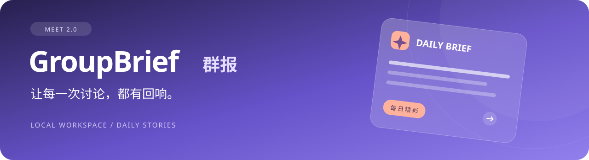
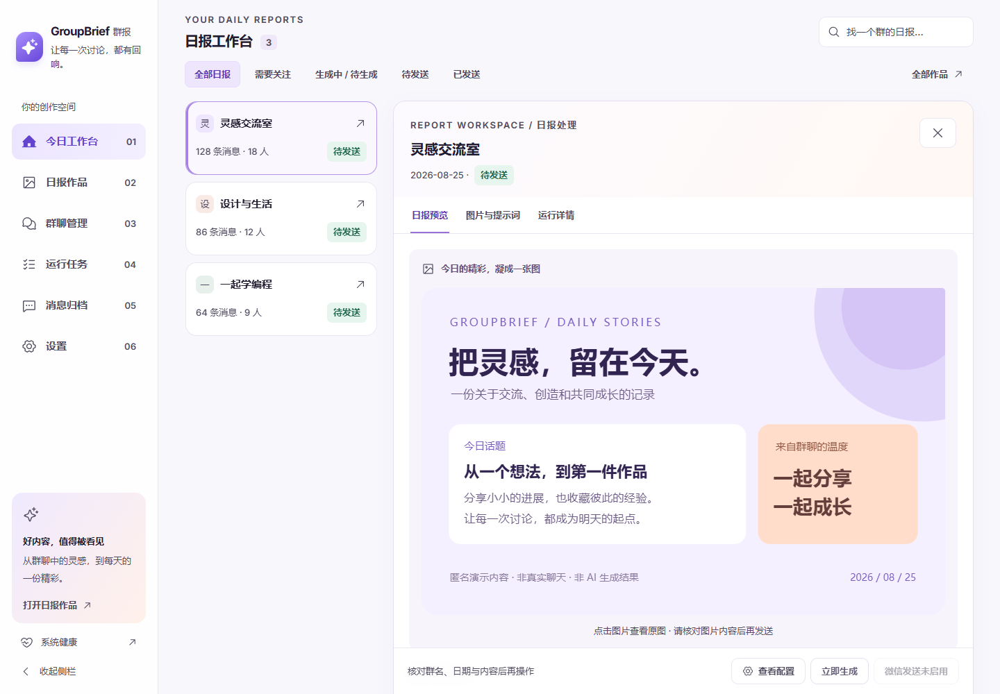
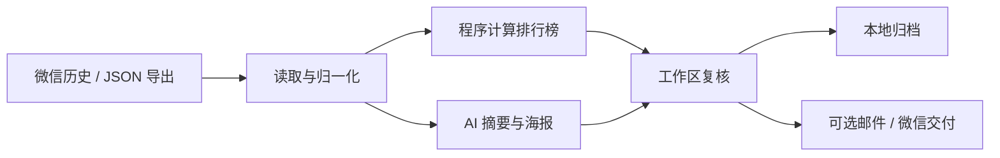

<p align="center">
  
</p>

<p align="center"><strong>把热闹的群聊，整理成值得留存的一份日报。</strong><br>Windows 本地群报工作台 · 精确排行 · AI 摘要与海报 · 复核与归档</p>

<p align="center">
  <a href="https://github.com/damingishere-coder/GroupBrief/releases"></a>
  <a href="https://github.com/damingishere-coder/GroupBrief/actions/workflows/ci.yml"></a>
  <a href="LICENSE"></a>
  
</p>

<p align="center">
  <a href="#快速开始">快速开始</a> ·
  <a href="docs/USER_GUIDE.md">使用指南</a> ·
  <a href="docs/UPGRADING.md">升级到 2.0</a> ·
  <a href="docs/README.md">文档中心</a> ·
  <a href="CHANGELOG.md">更新记录</a>
</p>


## 从聊天记录，到每日作品

群里讨论很多，值得保留的内容却容易被刷走。GroupBrief 把读取记录、计算排行、整理重点、制作海报和归档串成一条可检查的工作流，适合希望持续整理社群内容的群主与运营者。

| 看清发生了什么 | 做出值得分享的内容 | 每一步都有依据 |
| --- | --- | --- |
| 程序计算消息数、发言人数和排行榜，统计口径可配置 | AI 整理摘要与海报提示词，按群设置图片风格 | 按群、按日期保存原始消息、排行、提示词与运行状态 |
| 多群进度与待处理项集中在今日工作台 | 右侧工作区完成预览、修改、重新生成与复核 | 对外发送默认关闭；发送结果未知时等待人工核对 |

## 2.0：围绕每天的群报工作

- **今日工作台**：以日报卡片组织多群处理，打开右侧工作区时仍保留原列表。
- **日报作品**：把预览、提示词、图片、画廊、风格和排行榜模板集中管理。
- **更清楚的任务状态**：生成、图片校验、等待发送、结果未知分别呈现，诊断图不能作为正常日报自动交付。
- **工作日与周报**：支持工作日日报、周一上一自然周周报与总消息排行。
- **延续既有配置**：保留旧入口兼容和未保存草稿提醒；早期安装请按升级指南检查数据库结构。

查看完整 [2.0 更新记录](CHANGELOG.md) 与 [旧版升级步骤](docs/UPGRADING.md)。

## 看看新版界面

以下截图来自真实前端，以隔离的匿名演示数据渲染；不包含真实聊天，也不调用 AI、微信或邮件。

**打开一份日报，在同一工作区完成查看与复核。**



<details>
<summary><strong>展开查看群聊管理</strong></summary>


</details>

## 快速开始

需要 **Windows 10/11、Python 3.10+、Node.js 22+ 和 Git**。真实微信接入需要你自己的 Windows 微信与 WeChatDataAnalysis；AI 总结和生图需要已配置的模型服务。

在 PowerShell 中运行：

```powershell
git clone https://github.com/damingishere-coder/GroupBrief.git
Set-Location GroupBrief
Copy-Item .env.example .env
.\start_windows.bat
```

首次启动会创建虚拟环境、安装依赖并构建前端。完成后打开 **[本地工作台](http://127.0.0.1:8766)**。

1. **检查环境**：进入“设置 → 系统健康 / 启动检查”。
2. **接入一个群**：在“群聊管理”中绑定群并测试读取，保持发送关闭。
3. **生成与检查**：选一个有消息的日期，查看排行、提示词与图片。
4. **留存或交付**：在消息归档查看结果，完成实际微信环境验证后再开启发送。

已有安装请使用 [升级指南](docs/UPGRADING.md)，不要重复启动一个托管中的服务。Docker 仅用于开发与只读验证，参见 [Docker 说明](docs/DOCKER.md)。

## 工作方式



聊天数据库与运行文件存放在本机。使用模型服务时，完成总结和生图所需的内容会发送给你配置的服务；“本地工作台”不等于 AI 推理完全离线。

## 配置与数据

完整字段见 [`.env.example`](.env.example)。网页保存的运行设置持久化到数据库，可能覆盖同名环境配置。

| 配置 | 用途 |
| --- | --- |
| `WECHAT_MCP_URL` / `WECHAT_MCP_TOKEN` | 连接 WeChatDataAnalysis MCP，读取真实微信历史 |
| `WECHAT_EXPORT_DIR` | 从结构化 JSON 导出读取 |
| `CODEX_PATH` / `CODEX_HOME` | 定位已登录的 Codex CLI 与图片目录 |
| `AI_API_KEY` | 可选的 DeepSeek 备用配置 |
| `EMAIL_*` | 可选 SMTP 邮件配置，默认关闭 |
| `SCHEDULE_GENERATE_TIME` | 生成时间，默认 `00:15` |

每份群报保存于 `output/<群>/<运行日期>/`，包含本次产生的消息、排行榜、提示词、图片和 `run.json`。`.env`、`data/`、`output/` 与 `logs/` 不应提交到 Git。

## 能力边界

- 微信读取依赖本机账号数据、客户端版本、MCP 服务和权限。
- AI 与图片生成依赖模型服务、登录状态和可用额度。
- 邮件需要有效 SMTP；微信发送需要已登录微信、可交互桌面和适配的窗口 / OCR 环境。
- 自动化测试与单机验收不能代替其他微信版本、账号或桌面环境的实际验证。

只处理有权使用的数据。对外发送前检查群、日期、文字和图片；结果未知时先核对实际交付。敏感问题按 [安全说明](SECURITY.md) 报告。

## 文档与参与

| 使用与运维 | 开发与维护 |
| --- | --- |
| [使用指南](docs/USER_GUIDE.md) · [升级指南](docs/UPGRADING.md) | [贡献指南](CONTRIBUTING.md) · [分支与发布](docs/BRANCHING.md) |
| [文档中心](docs/README.md) · [更新记录](CHANGELOG.md) | [界面设计](docs/UI_REDESIGN.md) · [历史记录](docs/development-history/README.md) |

技术栈：**FastAPI · SQLite / SQLModel · APScheduler · React · TypeScript · Vite**。

欢迎通过 [Issues](https://github.com/damingishere-coder/GroupBrief/issues) 提交可复现的问题或使用建议，附上脱敏信息；贡献代码前请阅读验证与隐私约定。

---

<p align="center">GroupBrief 群报 · 让每一次讨论，都有回响。<br><a href="LICENSE">MIT License</a></p>
